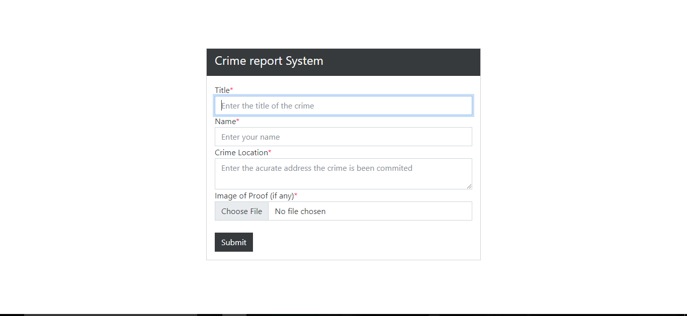

# Crime Report System Website With  Djangorestframework

# Setup for Django

* 1 - Clone project: git clone https://github.com/patoski716/crime-reporting-system-Djangorestframework.git
* 2 - cd promanager-django
* 3 - Create virtual environment: virtualenv myenv
* 4 - myenv\scripts\activate
* 5 - pip install -r requirements.txt
* 6 - python manage.py runserver